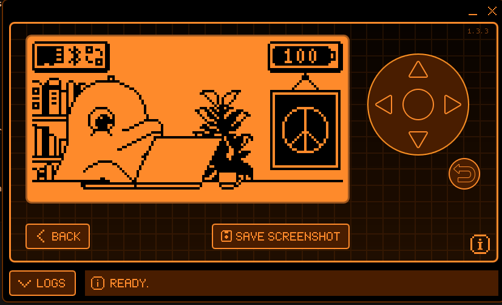

This will be a rewrite of https://github.com/besya/flipperzero-tuning-fork mostly so that I can teach myself a bit of C and Flipper Zero development.

The two differences will be:

- Code will use Scenes/Views instead of Viewport
- Tunings will be split into categories for Guitar, Bass, and Misc

TODO
- Figure out how to handle up/down keys in scenes
- ~~Figure out inconsistent back button operation~~
- ~~Split the data in tunings.h into categories somehow~~
- Get categories working
- Add "<" and ">" to Categories page

